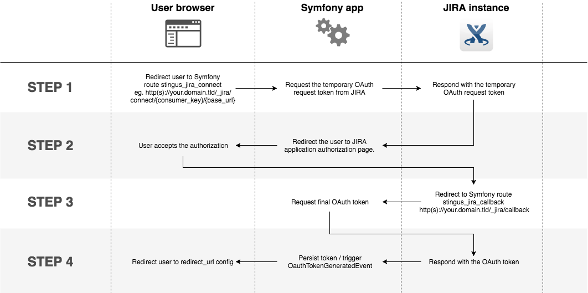

Usage
=====

***Make sure** you `issued`_ the private and public keys before going further

.. _issued: https://github.com/stingus/StingusJiraBundle/blob/master/Resources/doc/certificate.rst
.. _certificate generation doc: https://github.com/stingus/StingusJiraBundle/blob/master/Resources/doc/certificate.rst

Application authorization
-------------------------

Before sending any requests to JIRA API endpoints, you application needs to be authorized. Here's the authorization
workflow:

The workflow will be soon detailed, but first you need to deal with:

JIRA configuration
~~~~~~~~~~~~~~~~~~

1. Log in to your JIRA instance
2. Click the settings button in the top right corner (cog icon) and select "Applications"
3. On the left column click "Application links", under "Integrations"
4. Enter your application URL and click "Create new link". Click continue in the pop-up dialog
5. Fill in the required fields:
    i. Application name: choose whatever seems appropriate
    ii. Application type: leave "Generic Application" selected
    iii. Check "Create incoming link"
    iv. Leave the other fields empty and click "Continue"
6. Fill in the incoming parameters fields:
    i. Consumer key: create a unique string and save it, you'll need it later
    ii. Consumer name: (can be your application name)
    iii. Public key: copy & paste the contents of the public.key file (see `certificate generation doc`_)
    iv. Click "Continue" and you're done with the JIRA configuration

Learn more about `JIRA configuration`_.

.. _JIRA configuration: https://developer.atlassian.com/cloud/jira/platform/jira-rest-api-oauth-authentication/

Starting the authorization process
~~~~~~~~~~~~~~~~~~~~~~~~~~~~~~~~~~

After configuring your JIRA instance to accept connections from your application, you can start the authorization
process. In one of your application's controllers issue a forward or a redirect to the following route:

.. code-block:: php

    <?php
    // src/AppBundle/Controller/DefaultController.php

    // Using a forward
    public function forwardAction()
    {
        return $this->forward(
            'StingusJiraBundle:Oauth:connect',
            [],
            [
                'tokenId' => 'existing_token_id',
                'consumerKey' => 'your_consumer_key',
                'baseUrl' => 'https://example.atlassian.net',
            ]
        );
    }

    // Using a redirect
    public function redirectAction()
    {
        return $this->redirectToRoute(
            'stingus_jira_connect',
            [
                'tokenId' => 'existing_token_id',
                'consumerKey' => 'your_consumer_key',
                'baseUrl' => 'https://example.atlassian.net',
            ]
        );
    }

This will forward the request to the first step of the authorization process, using a controller exposed by this bundle.
You'll need to provide the following route parameters:

``tokenId``: (optional) if you're using the ORM feature and you already have saved a temporary token in the DB, you
can pass it to the authorization step. This way, your saved token will be updated once the authorization is complete

``consumerKey``: the consumer key used in JIRA configuration step 6i

``baseUrl``: the base URL of your JIRA instance (eg. https://example.atlassian.net)

The browser will then be redirected to the application authorization page of JIRA. After the user
authorizes your application, il will be redirected to the ``redirect_url`` set in your config.yml.

You can also start the authorization from a Twig template:

.. code-block::

    # src/AppBundle/Resources/views/Default/index.html.twig

    <a href="{{ path('stingus_jira_connect', { "tokenId": existing_token_id, "consumerKey": "your_consumer_key", "baseUrl": "https://example.atlassian.net" }) }}">Authorize</a>

Saving the OAuth token for JIRA requests
~~~~~~~~~~~~~~~~~~~~~~~~~~~~~~~~~~~~~~~~

If you choose to use the built-in ORM persistence (see `Installation & configuration`_), right after the user
authorizes your application, the token is persisted in the DB so it can be used when issuing new requests to JIRA.

.. _Installation & configuration: https://github.com/stingus/StingusJiraBundle/blob/master/Resources/doc/install.rst

Catching the OauthTokenGeneratedEvent
~~~~~~~~~~~~~~~~~~~~~~~~~~~~~~~~~~~~~

If you're not using Doctrine ORM, you'll need a way to catch the OAuth token and persist it somehow. When a valid OAuth
token is received from JIRA, the bundle emits a ``Stingus\Jira\Event\OauthTokenGeneratedEvent`` event which will contain
the token. To catch this event and process the token, you need to configure your own Symfony listener / subscriber.
Here's a subscriber example catching this event:

.. code-block:: php

    <?php
    // src/AppBundle/EventListener/OauthTokenListener.php

    namespace AppBundle\EventListener;

    use Stingus\JiraBundle\Event\OauthTokenGeneratedEvent;
    use Stingus\JiraBundle\StingusJiraEvents;
    use Symfony\Component\EventDispatcher\EventSubscriberInterface;

    class OauthTokenListener implements EventSubscriberInterface
    {
        public static function getSubscribedEvents()
        {
            return [
                StingusJiraEvents::OAUTH_TOKEN_GENERATE => [
                    ['onTokenGenerate', 0],
                ],
            ];
        }

        public function onTokenGenerate(OauthTokenGeneratedEvent $event)
        {
            $oauthToken = $event->getOauthToken();

            // Persist the $oauthToken
        }
    }

Configure the listener:

.. code-block:: yaml

    services:
      app_bundle.oauth.listener:
        class: AppBundle\EventListener\OauthTokenListener
        tags:
           - { name: kernel.event_subscriber }

Making JIRA requests
--------------------

After you have persisted the OAuth token, you can now make requests to JIRA API. For example, in a controller:

.. code-block:: php

    <?php
    // src/AppBundle/Controller/DefaultController.php

    // POST example
    public function createIssueAction($consumerKey)
    {
        // Retrieve the OAuth token from storage, using the provided OAuthTokenManager
        $oauthToken = $this->get(OauthTokenManager::SERVICE_ID)->getRepository()->find($tokenId);

        $body = '{...JSON encoded, check JIRA documentation below...}';

        // Make a POST JIRA request to create an issue
        $response = $this->get(JiraRequest::SERVICE_ID)->post($oauthToken, '/rest/api/latest/issue', [], $body);

        return new Response($response->getBody()->getContents());
    }

    // GET example
    public function getIssueAction($consumerKey, $issueId)
    {
        // Retrieve the OAuth token from storage, using the provided OAuthTokenManager
        $oauthToken = $this->get(OauthTokenManager::SERVICE_ID)->getRepository()->find($tokenId);

        // Make a GET JIRA request to get an issue
        $response  = $this->get(JiraRequest::SERVICE_ID)->get($oauthToken, '/rest/api/latest/issue/'.$issueId);

        return new Response($response->getBody()->getContents());
    }

    // PUT example
    public function setEstimationAction($consumerKey, $issueId, $boardId)
    {
        // Retrieve the OAuth token from storage, using the provided OAuthTokenManager
        $oauthToken = $this->get(OauthTokenManager::SERVICE_ID)->getRepository()->find($tokenId);

        // Make a PUT JIRA request to save the estimation
        $response = $this->get(JiraRequest::SERVICE_ID)->put(
            $oauthToken,
            '/rest/agile/1.0/issue/'.$issueId.'/estimation',
            ['boardId' => $boardId],
            json_encode(['value' => 11])
        );

        return new Response($response->getBody()->getContents());
    }

    // DELETE example
    public function deleteIssueAction($consumerKey, $issueId, $boardId)
    {
        // Retrieve the OAuth token from storage, using the provided OAuthTokenManager
        $oauthToken = $this->get(OauthTokenManager::SERVICE_ID)->getRepository()->find($tokenId);

        // Make a DELETE JIRA request to delete an issue
        $response = $this->get(JiraRequest::SERVICE_ID)->delete($oauthToken, '/rest/api/latest/issue/'.$issueId);

        return new Response($response->getBody()->getContents());
    }

That's it! Check the `documentation for JIRA API`_ to learn more about the endpoints.

.. _documentation for JIRA API: https://developer.atlassian.com/cloud/jira/platform/jira-cloud-platform-rest-api/
